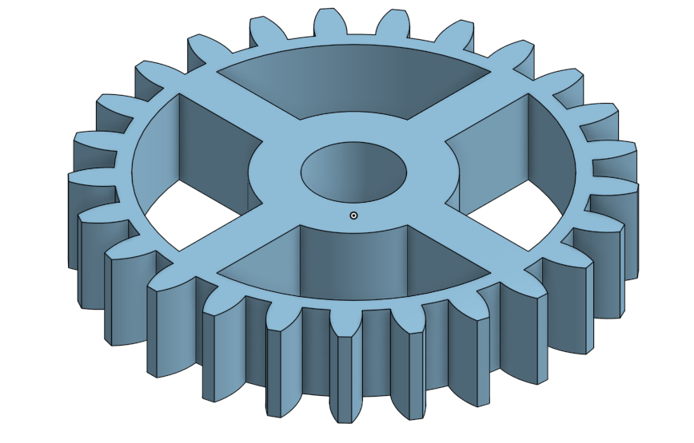

## SPUR GEAR CALCULATOR

# About This Project :

This program will generate some necessary parameters for the creation of a cylindrical spur gear using
3d CAD modeling.

- What is a Spur Gear ?

    * The most common and simple designed toothed wheel with parallel teeth wich mesh with another toothed part to transmit torque and speed.

-  A Spur Gear :

