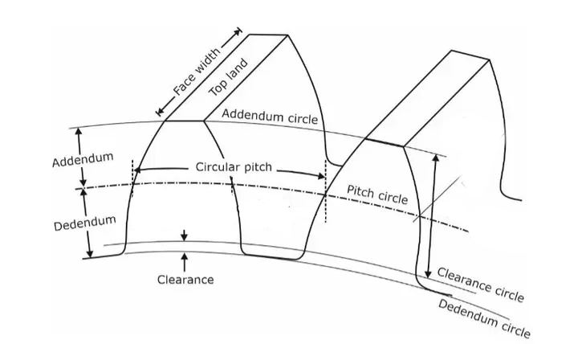
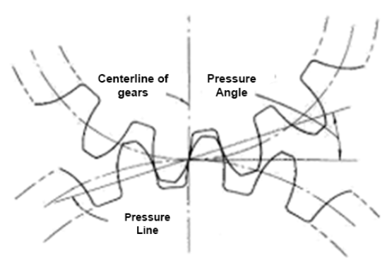
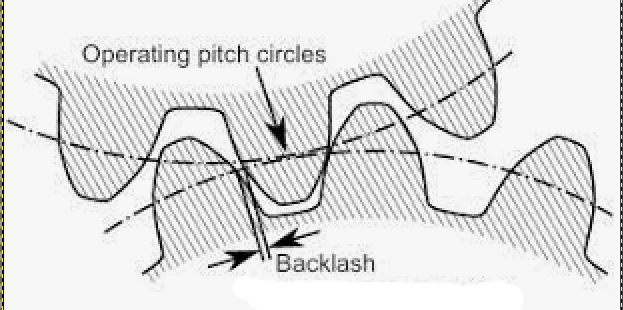

## SPUR GEAR CALCULATOR

# About This Project :

This program will generate some necessary parameters for the creation of a cylindrical spur gear using
3d CAD modeling.

- What is a Spur Gear ?

    * The most common and simple designed toothed wheel with parallel teeth wich mesh with another toothed part to transmit torque and speed.

-  A Spur Gear :

- Gear Terminology :

* Module

The unit of size defined by ISO that indicates how big or small a gear is. Gears will only mesh with each other if they have teeth of the same module.

* Pitch Circle 

A Theoretical circle on wich all calculations are based. The diameter of pitch circle is called the effective diameter or pitch diameter.

* Circular Pitch

The distance from one point of a gear tooth to another tooth point measured along the pitch circle.

* Diametral Pitch

Relates to the ratio of gear teeth and pitch diameter. Pitch diameter is the measured diameter of a pitch circle. Essentially, the diametrical pitch of a gear is the number of gear teeth for each inch of pitch diameter.

* Addendum

Radial Height of the tooth from pitch Circle to top of the tooth.

* Addendum Circle

The circle wich limits the top of the gear tooth.

* Clearance

The radial distance from the top of the tooth to the bottom of the tooth.

* Deddendum

The radial depth of tooth to the pitch circle to the root of the tooth.

* Deddendum Circle

The circle wich limits the bottom of the gear tooth.

* Pressure Angle

The angle between the tooth face and the gear wheel tangent.

* Circular Pitch Angle

The angle at a pitch point between the line of pressure which is normal to the tooth surface, and the plane tangent to the pitch surface.

* Face Width

The axial length of a gear tooth is called the face width

* Backlash

The amount by which a tooth space exceeds the thickness of a gear tooth engaged in mesh.