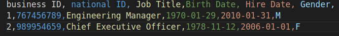

## WRITE TO CSV 

# About This Project :

The idea of this code is to write rows to a preset CSV file

- What is a CSV file ?

    * A comma-separated-value file that has a specific format wich allows data to be saved in a table structured format.

- What is a CSV file used for ?

    * A way to store data that can be easily exchanged between programs

-  Example:

- Python CSV Module :
WRITE TO CSV 

    * https://docs.python.org/3/library/csv.html

    

# Why ?

- A simple interative way to write rows to a preseted with headers CSV file.

# Basic Instruction : 

    1. Firt define the headers of your CSV file in the preset file (preset_file.csv) structured like the default documment 

    2. Edit the headers list inside the write_to_csv.py file using your custom headers writed in preset_file.csv

    3. Run  write_to_csv.py using Python